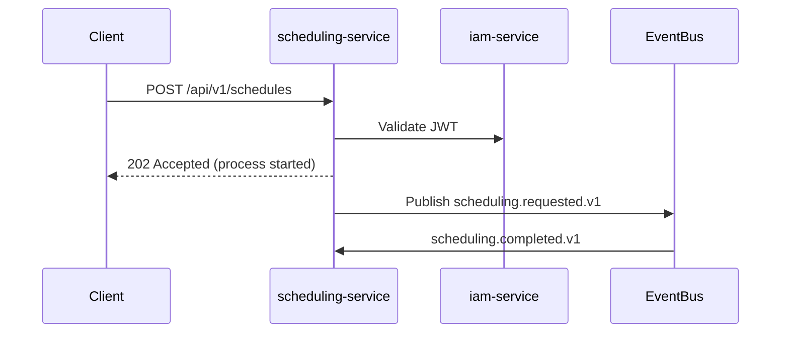

# Patrones de Comunicación

Este documento resume los patrones técnicos recomendados para la integración entre microservicios.

## Resumen

- Comunicación síncrona: REST/HTTP con OpenAPI para latencias < 500ms y operaciones CRUD.
- Comunicación asíncrona: Pub/Sub (Kafka o RabbitMQ) para eventos de dominio y procesos largos.
- Mensajería persistente para reconciliación y reintentos.

## Contratos y API-first

- Definir OpenAPI 3.1 por cada microservicio. Versionado semántico en la ruta: `/api/v1/...`.

## Resiliencia

- Retries exponenciales con jitter para llamadas externas (max 3 intentos).
- Circuit Breaker (Resilience4j / Spring Cloud Circuit Breaker) con política: abrir al 50% de errores en 1 minuto.
- Bulkhead para aislar recursos críticos.

## Mensajería y eventos

- Topics con formato `domain.service.event.v1`.
- Eventos idempotentes: incluir `eventId`, `occurredAt`, `sourceService`, `aggregateId`.
- Uso de compacted topics para estados derivados (cuando aplique).

## Observabilidad

- Trazas: OpenTelemetry con propagación W3C `traceparent`.
- Métricas: Prometheus exposition endpoint `/actuator/prometheus`.
- Logs estructurados JSON con `correlationId` y `userId`.

## Patrón de sagas y compensaciones

- Para procesos distribuidos de larga duración (p.ej. reprocesos de asignación de horarios) usar orquestador basado en eventos o choreography con compensaciones y estado de saga en tabla `sagas` en PostgreSQL.

## Seguridad en transporte

- TLS obligatorio en todas las comunicaciones entre servicios en producción.
- JWT firmado con clave asimétrica (RS256). Validar `iss`, `aud`, `exp`, `scope`.

## Ejemplo (Mermaid) — Flujo síncrono + asíncrono

# Patrones de comunicación

> Estado: 🔴 | Última actualización: 2026-06-16
> Autor: Por definir | Equipo: Por definir

## Síncrona (REST / gRPC)

## Asíncrona (eventos)

## Resiliencia

<!-- Circuit breaker, retry, timeout -->
