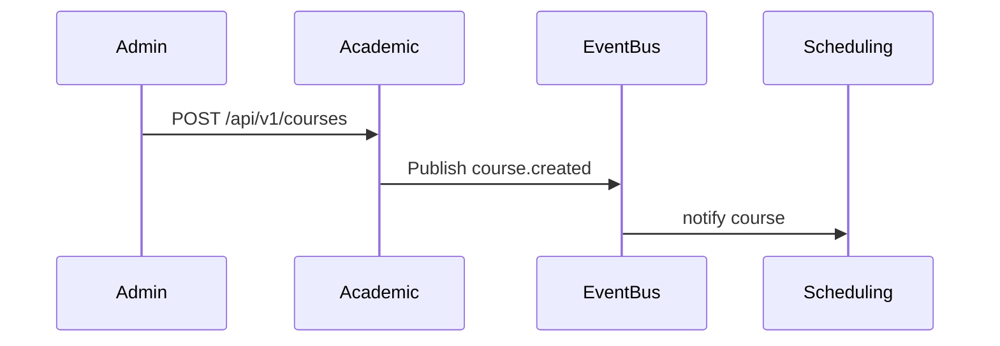

# academic-management-service

## Objetivo

Gestionar el catálogo académico: programas, cursos, asignaturas y relaciones curriculares necesarias para la generación de horarios.

## Responsabilidades

- CRUD de cursos y asignaturas.
- Definición de cargas horarias y prerrequisitos.
- Publicación de `course.created` y `course.updated`.

## Límites de negocio

- No gestiona asignaciones a instructores ni disponibilidad de entornos; eso es responsabilidad de `actors-service` y `training-environment-service`.

## Casos de uso

- Crear un nuevo curso con su carga horaria.
- Actualizar requisitos y horas por semana.

## Entidades del dominio

| Entidad | Descripción |
|---|---|
| course | Curso (id, code, name, credits, weeklyHours) |
| subject | Asignatura (id, name, course_id) |

## DTOs

- `CourseDTO { id, code, name, weeklyHours }`

## Reglas de validación

- weeklyHours > 0 y <= 40.

## Persistencia e índices

- Tabla `courses` con índice por `code` y `name`.

## Flujo (Mermaid)

## Riesgos

- Cambios en carga horaria afectan generación de horarios existentes.

## Escalabilidad

- Lecturas frecuentes por `scheduling-service`; usar read-replicas.
