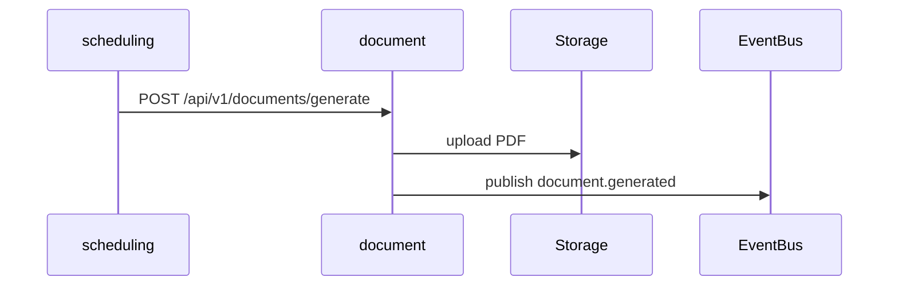

# document-service

## Objetivo

Generar, almacenar y servir documentos y reportes (PDF) relacionados con horarios, actas y evidencias académicas.

## Responsabilidades

- Generación de PDFs a partir de plantillas y datos.
- Almacenamiento de metadatos en PostgreSQL y objetos en S3 compatible.
- Exposición de signed URLs para descarga.

## Límites de negocio

- No gestiona contenido de cursos; consume datos de `academic-management-service` y `scheduling-service`.

## Casos de uso

- Generar reporte de horario para un programa.
- Subir evidencia y asociarla a una entidad académica.

## Entidades y DTOs

- `document { id, ownerId, type, storagePath, checksum, createdAt }`

## Reglas de validación

- Tamaño máximo configurable (p.ej. 100MB). Extensiones permitidas controladas por type.

## Persistencia e índices

- Índice `documents(owner_id)` y `documents(type, created_at)`.

## Flujo (Mermaid)

## Riesgos

- Coste de almacenamiento por grandes volúmenes de PDFs. Plan de purgado según retención.

## Escalabilidad

- Worker pool para generación; CDN para servir archivos estáticos.
