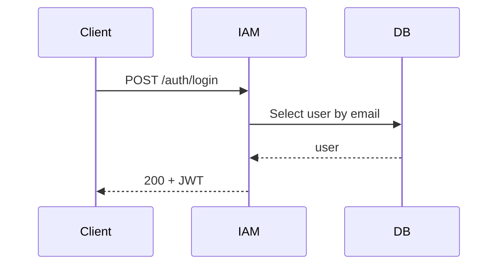

# iam-service

## Objetivo del servicio

Gestionar identidad, autenticación y autorización para el ecosistema. Emite y valida JWT, gestiona usuarios, roles y scopes.

## Responsabilidades

- Registro de usuarios y credenciales.
- Emisión y revocación de tokens JWT (RS256).
- Gestión de roles, permisos y scopes.
- Endpoints para introspección y renovación de tokens.

## Límites de negocio

- No almacena detalles académicos ni horarios; solo identidad y autorizaciones.

## Casos de uso

- Registrar usuario institucional.
- Autenticar y devolver JWT.
- Asignar roles a usuarios.

## Entidades del dominio

| Entidad | Descripción |
|---|---|
| user | Identidad del individuo (id, email, nombre, estado) |
| role | Rol funcional con conjunto de permisos |
| token_revocation | Lista de tokens revocados (jti, expiry) |

## DTOs principales

- `AuthRequest { username, password }`
- `AuthResponse { accessToken, refreshToken, expiresIn }`
- `UserDTO { id, email, fullName, roles }`

## Reglas de validación

- Email válido institucional.
- Password mínimo 12 caracteres, 1 mayúscula, 1 número y 1 carácter especial.

## Seguridad y permisos

- Endpoints sensibles requieren `admin` role o scopes específicos (`iam:manage`, `iam:issue-token`).
- Firmas RSA para tokens; publicar claves públicas en `/.well-known/jwks.json`.

## Estrategia de persistencia

- PostgreSQL para usuarios y roles. Tokens cortos (access 15min) y refresh tokens con rotación.

## Índices recomendados

- `users(email)` UNIQUE, `roles(name)`.

## Flujo de negocio (Mermaid)

## Riesgos técnicos

- Exposición de claves privadas.
- Gestión de revocación a gran escala.

## Consideraciones de escalabilidad

- Stateless access tokens; escalar instancias de emisión. Almacenar revocations en Redis para latencia baja.
