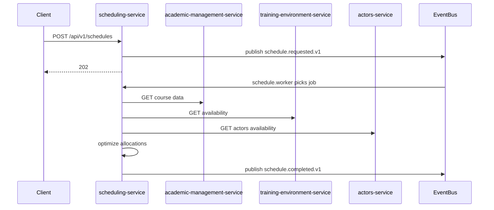

# scheduling-service

## Objetivo

Generar, optimizar y exponer horarios para programas, asignando cursos a franjas horarias, entornos y actores (instructores y estudiantes) respetando restricciones institucionales.

## Responsabilidades

- Recepción de solicitudes de planificación.
- Algoritmo de asignación que resuelve colisiones y optimiza criterios (utilización, preferencias).
- Persistencia de estados de generación y resultado final.

## Límites de negocio

- No realiza gestión de identidad ni documentos; interactúa con `iam-service`, `actors-service`, `training-environment-service` y `academic-management-service`.

## Casos de uso

- `GenerarHorario` — crear un plan de horarios para un curso/programa.
- `RecalcularHorario` — re-ejecutar optimización tras cambios en datos de referencia.

## Entidades del dominio

| Entidad | Descripción |
|---|---|
| schedule | Plan de horario (id, status, createdAt, metadata) |
| allocation | Asignación (schedule_id, course_id, subject_id, instructor_id, environment_id, start, end) |
| conflict | Conflicto detectado (allocation_id, reason) |

## DTOs principales

- `ScheduleRequest { programId, term, constraints[], optimizationGoals[] }`
- `ScheduleStatus { scheduleId, status, progress }`

## Endpoints REST

| Método | Ruta | Request | Response | Roles/Scopes |
|---|---|---|---|---|
| POST | /api/v1/schedules | `ScheduleRequest` | 202 Accepted `{ scheduleId }` | `schedule:write` |
| GET | /api/v1/schedules/{id} | - | `ScheduleStatus` | `schedule:read` |
| GET | /api/v1/schedules/{id}/result | - | `ScheduleResultDTO` | `schedule:read` |
| POST | /api/v1/schedules/{id}/cancel | - | 204 No Content | `schedule:manage` |

## Eventos publicados

- `schedule.requested.v1` — inicio del proceso.
- `schedule.completed.v1` — proceso finalizado con resultado y metadatos.

## Eventos consumidos

- `course.created.v1`, `reference.updated.v1`, `actor.updated.v1`, `environment.updated.v1` — disparan recalculaciones si impactan resultados.

## Reglas de validación

- Las restricciones deben ser expresables como predicados sobre asignaciones; fechas y horas en formato ISO-8601; número máximo de horas por docente por semana <= 40.

## Estrategia de persistencia

- Tablas `schedules`, `allocations`, `conflicts`, `schedule_jobs`.
- Almacenamiento de resultados en JSONB para rápida consulta y reconstrucción.

## Índices recomendados

- `CREATE INDEX idx_allocations_schedule ON allocations(schedule_id);`
- `CREATE INDEX idx_allocations_instructor ON allocations(instructor_id, start, end);`

## Flujo de negocio (Mermaid)

## Riesgos técnicos

- Algoritmo de optimización con alta complejidad; necesidad de tuning y límites de tiempo.
- Datos inconsistentes entre servicios que generarían resultados inválidos.

## Escalabilidad

- Ejecutar workers de optimización en cluster (K8s), uso de colas para jobs y particionado por `programId` o `term`.
