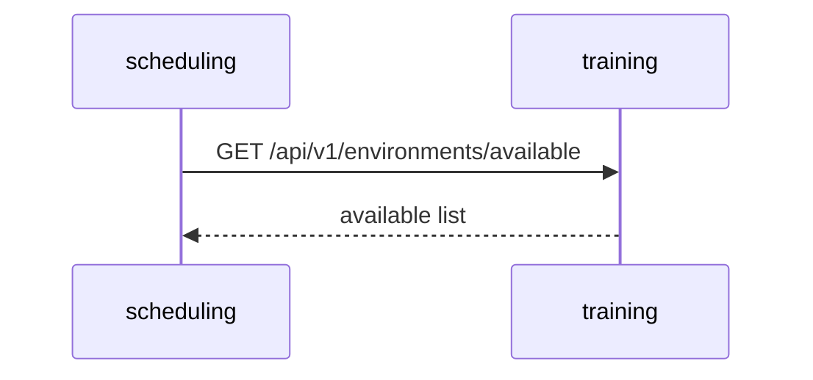

# training-environment-service

## Objetivo

Gestionar entornos de formación: aulas, laboratorios y recursos (capacidad, equipamiento, disponibilidad).

## Responsabilidades

- CRUD de entornos y capacidades.
- Disponibilidad por franja horaria.
- Publicar `environment.updated` ante cambios.

## Límites de negocio

- No asigna actores; solo provee disponibilidad y características de recursos.

## Casos de uso

- Reservar un aula para una sesión de clase.
- Actualizar capacidad o estado de un laboratorio.

## Entidades y DTOs

- `Environment { id, name, capacity, type, features[] }`

## Persistencia e índices

- Tabla `environments` con índice por `type` y `name`.

## Reglas de validación

- capacity >= 0; features lista no vacía para laboratorios especializados.

## Flujo (Mermaid)

## Riesgos

- Incoherencias entre capacidades reales y registradas.

## Escalabilidad

- Cache de lecturas para disponibilidad, invalidación por eventos.
